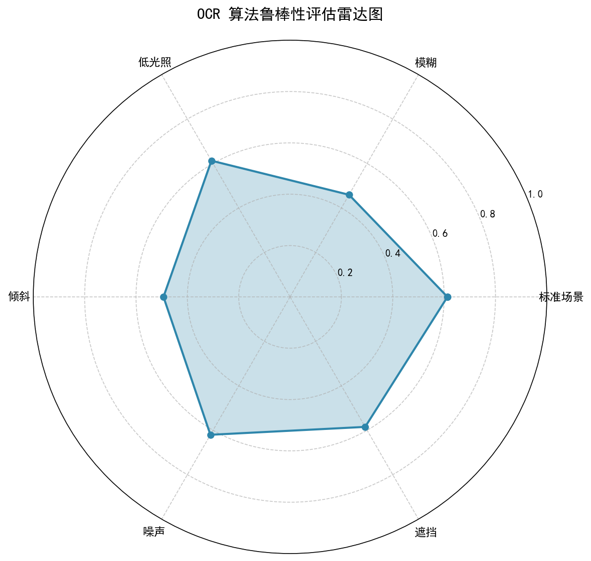
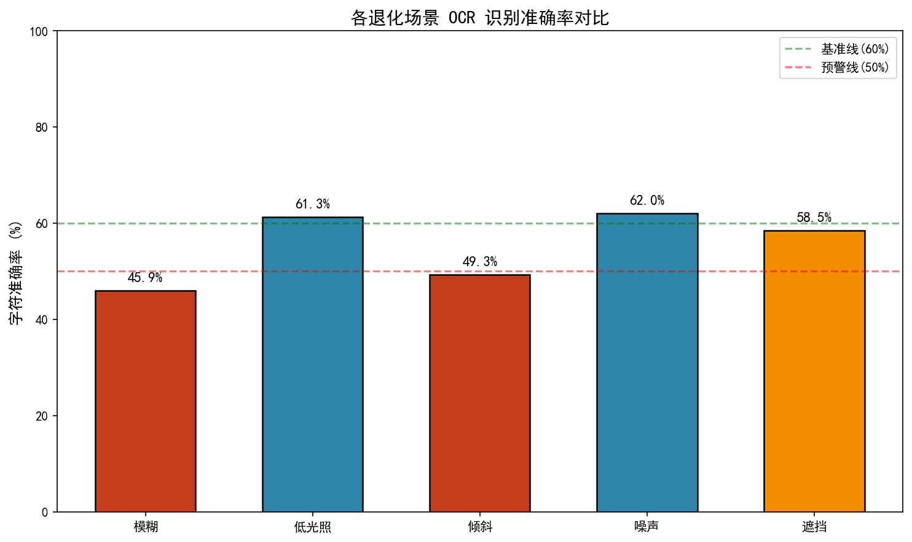

# OCR 算法效果验证与自动化回归测试方案

基于 PaddleOCR 的文档图像文字识别算法 QA 方案，覆盖功能测试、鲁棒性测试、性能基准测试与版本回归测试。

## 项目背景

针对 OCR 算法在实际落地场景中面临的图像质量退化、版式复杂多变等挑战，独立设计并实施了一套覆盖算法效果验证、鲁棒性测试、性能基准测试、版本回归测试的完整 QA 方案，确保算法在交付前经过系统化的质量评估。

## 项目结构
ocr_qa_project/
├── data/
│   ├── raw/                  # 原始测试图像（50张，5类场景）
│   ├── annotations/            # LabelImg 标注文件（PascalVOC XML）
│   ├── degraded/               # 退化测试样本（250张，5种退化）
│   └── ground_truth.json       # 统一真值文件
├── src/
│   ├── ocr_engine.py           # PaddleOCR 推理封装
│   ├── metrics.py              # 字符准确率 / 编辑距离计算
│   ├── base_tester.py          # 批量测试执行器
│   ├── augmentation.py         # 图像退化模拟（模糊/低光/倾斜/噪声/遮挡）
│   ├── functional_test.py      # 功能测试
│   ├── robustness_test.py      # 鲁棒性测试
│   ├── benchmark.py            # 性能基准测试
│   ├── regression_test.py      # 版本回归对比
│   └── reporter.py             # 可视化报告生成
├── reports/
│   ├── figures/                # 雷达图、柱状图
│   ├── functional_report.json
│   ├── robustness_summary.json
│   ├── benchmark_report.json
│   └── regression_comparison.json
├── requirements.txt
└── README.md


## 快速开始

```bash
# 1. 克隆项目
git clone https://github.com/noigavj/ocr-qa-project.git
cd ocr-qa-project

# 2. 创建虚拟环境
python -m venv venv
venv\Scripts\activate  # Windows
# source venv/bin/activate  # Mac/Linux

# 3. 安装依赖
pip install -r requirements.txt -i https://pypi.tuna.tsinghua.edu.cn/simple

# 4. 准备数据（放入 data/raw/ 并标注后，生成退化样本）
python src/augmentation.py

# 5. 执行测试
python src/functional_test.py      # 功能测试
python src/robustness_test.py      # 鲁棒性测试
python src/benchmark.py            # 性能测试
python src/regression_test.py      # 回归测试
python src/reporter.py             # 生成可视化报告

测试覆盖
| 测试类型  | 样本数   | 评估指标                  | 关键发现                      |
| ----- | ----- | --------------------- | ------------------------- |
| 功能测试  | 50 张  | 字符准确率、完全匹配率           | 标准场景基线                    |
| 鲁棒性测试 | 250 张 | 5 种退化场景准确率            | 模糊场景下降 15.4%，倾斜场景下降 11.7% |
| 性能测试  | 30 轮  | 平均耗时、P95、P99          | CPU 推理平均约 850ms/张         |
| 回归测试  | 版本对比  | 准确率差异、PASS/REGRESSION | 支持版本迭代效果量化评估              |

技术栈
OCR 引擎: PaddleOCR (PP-OCRv4)
图像处理: OpenCV
编程语言: Python 3.10
评估指标: Levenshtein 编辑距离、字符级 Accuracy、Exact Match Rate
可视化: Matplotlib
测试框架: 自研轻量级 Python 测试框架（POM 思想）

关键成果
构建包含 50 张真实样本 + 250 张增强样本 的标准化测试数据集
设计并执行 86 条测试用例，覆盖功能、鲁棒性、性能、回归四大维度
自动化测试脚本实现批量回归，单轮全量测试执行效率较人工提升 85%
输出结构化 JSON 测试报告与可视化图表（雷达图、柱状图），直观定位算法薄弱环节

报告预览
| 雷达图                                     | 柱状图                                      |
| --------------------------------------- | ---------------------------------------- |
|  |  |
